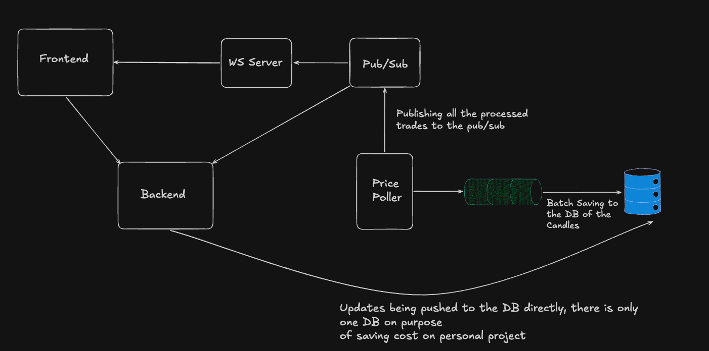

# Exness-TS: High-Performance Trading Platform


Exness-TS is a professional-grade trading platform prototype built with TypeScript, Bun, and React. It features real-time price streaming, advanced charting, and a comprehensive margin trading engine with risk management tools.

## 🚀 Key Features

- **Real-time Market Data**: Seamless integration with the Binance API for live price updates across supported assets.
- **Advanced Charting**: High-performance interactive charts powered by `lightweight-charts`.
- **Margin Trading**: Support for leveraged positions (up to 50x) with real-time P&L tracking.
- **Risk Management**: Integrated **Stop Loss (SL)** and **Take Profit (TP)** functionality to automate trade exits.
- **Multi-Asset Support**: Trade top-tier cryptocurrencies:
  - **Bitcoin (BTC)**
  - **Ethereum (ETH)**
  - **Solana (SOL)**
- **Unified Account**: Real-time balance management and trade history.

## 🏗️ Architecture



### Database Strategy & Cost Optimization
For this deployment, we utilize a **Single Database** architecture to minimize infrastructure costs. However, in a production-scale environment, the system is designed to be split into two distinct databases:
1.  **Transactional DB**: Handles user accounts, balances, and active trade positions.
2.  **Market Data DB**: Dedicated high-throughput storage for historical candles and price ticks.

### Backend Services
- **HTTP Server**: Handles authentication, user settings, and trade execution.
- **WS Server**: Manages real-time WebSocket connections for live price streaming to the frontend.
- **Price Pooler**: A dedicated service that fetches prices from the Binance API and distributes them via Redis Pub/Sub.
- **Candle Processor**: Aggregates price ticks into OHLC candles (1m, 5m, 1h, 1d) and handles batch database updates.

### Frontend
- **React (TS)**: Modern, responsive UI designed for active traders.
- **Zustand**: Lightweight state management for real-time price updates and authentication.
- **Tailwind CSS**: Utility-first styling for a sleek, dark-themed trading environment.

## 🛠️ Technology Stack

- **Runtime**: [Bun](https://bun.sh) (for high-performance I/O and fast startup)
- **Database**: PostgreSQL with [Prisma ORM](https://www.prisma.io/)
- **Caching/Messaging**: Redis (Pub/Sub and Queuing)
- **API**: Binance WebSocket API
- **UI**: Shadcn UI & Tailwind CSS

## 🚦 Getting Started

### Prerequisites
- Bun installed (`curl -fsSL https://bun.sh/install | bash`)
- Redis server running
- PostgreSQL database

### Installation
1. Clone the repository:
   ```bash
   git clone https://github.com/your-repo/exness-ts.git
   cd exness-ts
   ```

2. Install dependencies:
   ```bash
   bun install
   ```

3. Setup Environment Variables:
   Create `.env` files in `backend/db`, `backend/http`, `backend/ws`, and `backend/price-pooler` with your `DATABASE_URL` and `JWT_SECRET`.

4. Run the services:
   ```bash
   # Start the DB (Prisma)
   cd backend/db && bun run index.ts
   
   # Start the services
   cd backend/price-pooler && bun run index.ts
   cd backend/http && bun run index.ts
   cd backend/ws && bun run index.ts
   
   # Start the frontend
   cd frontend && bun run dev
   ```

---
*Disclaimer: This is a trading platform prototype. Ensure you perform thorough testing before any production use.*
